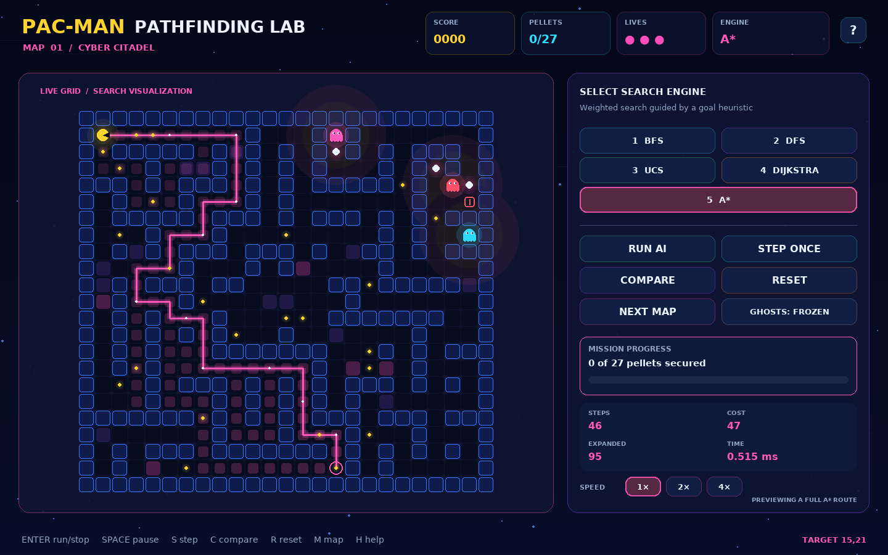

# Optimized Pac-Man AI Pathfinding Lab

An interactive AI Lab project where Pac-Man automatically collects every data
pellet, avoids moving ghosts, and reaches an exit by using one of five classical
search algorithms: **BFS, DFS, UCS, Dijkstra, or A\***.



The interface visualizes explored cells, the chosen path, weighted danger zones,
and live performance measurements. A built-in comparison screen runs all five
algorithms from the same start cell to the same target for a fair demonstration.

## Main features

- Five independent, selectable search implementations
- Animated search exploration and route visualization
- Three deterministic, replayable neon mazes
- Moving ghosts that chase Pac-Man with BFS
- Risk-aware weighted paths around ghosts
- Normal pellets, power pellets, score, lives, and locked exit
- Automatic target selection and dynamic replanning
- Weighted terrain with movement costs of 1, 2, or 3
- Side-by-side algorithm comparison table
- Path steps, total cost, expanded nodes, frontier peak, and runtime metrics
- Run, pause, single-step, reset, map switch, speed, and ghost controls
- Procedural graphics and optional sound, with no external asset downloads
- Unit tests for algorithms, maps, and gameplay logic

## Requirements

- Python 3.10 or newer
- Windows, macOS, or Linux
- Approximately 50 MB of free disk space after dependency installation

No database, API key, internet connection, or external game asset is required
after installation.

## Setup and run

### Windows PowerShell

Open PowerShell inside the extracted project folder, then run:

```powershell
py -m venv .venv
.venv\Scripts\Activate.ps1
python -m pip install -r requirements.txt
python main.py
```

If PowerShell blocks activation, allow it only for the current terminal session:

```powershell
Set-ExecutionPolicy -Scope Process -ExecutionPolicy Bypass
```

Then activate the environment again. You can use `run_windows.bat` on later runs.

### macOS or Linux

Open a terminal inside the extracted project folder, then run:

```bash
python3 -m venv .venv
source .venv/bin/activate
python -m pip install -r requirements.txt
python main.py
```

You can use `./run_linux.sh` on later runs.

## Controls

| Action | Keyboard | Interface |
|---|---:|---|
| Select BFS, DFS, UCS, Dijkstra, A* | `1` to `5` | Algorithm buttons |
| Start or stop the AI | `Enter` | Run AI / Stop AI |
| Pause or resume | `Space` | Keyboard only |
| Move one planned cell | `S` | Step Once |
| Compare every algorithm | `C` | Compare |
| Reset the current map | `R` | Reset |
| Load the next map | `M` | Next Map |
| Freeze or activate ghosts | `G` | Ghosts button |
| Open help | `H` | `?` button |
| Close a dialog | `Esc` | Close button |

Use the **Ghosts: Frozen** setting during a classroom explanation if you want a
repeatable algorithm comparison without a moving environment.

## What the colors mean

| Visual | Meaning |
|---|---|
| Bright route line | Current path selected by the active algorithm |
| Transparent colored cells | Nodes expanded during search |
| Purple or pink floor tile | Weighted terrain with a higher movement cost |
| Red/orange ghost aura | Dynamic danger cost used by UCS, Dijkstra, and A* |
| Pink-white large pellet | Power pellet that makes ghosts vulnerable |
| Red exit | Locked while pellets remain |
| Green exit | Unlocked after every pellet is collected |

## Algorithm summary

| Algorithm | Main data structure | Weighted | Optimal in this project | Best demonstration point |
|---|---|---:|---:|---|
| BFS | Queue | No | Fewest steps only | Simple unweighted shortest path |
| DFS | Stack | No | No | Deep exploration can choose a long route |
| UCS | Priority queue | Yes | Yes | Chooses the lowest accumulated cost |
| Dijkstra | Priority queue | Yes | Yes | Shortest paths with non-negative weights |
| A* | Priority queue + heuristic | Yes | Yes | Usually expands fewer cells toward one goal |

**Important viva point:** UCS and Dijkstra use the same priority rule in this
single-source, single-target, non-negative weighted grid. Their results therefore
normally match. They remain separate implementations so the class can compare
their terminology and code structure.

The full explanation is in [docs/ALGORITHMS.md](docs/ALGORITHMS.md).

## Fair comparison rule

The Compare button takes one snapshot containing:

- the same Pac-Man position;
- the same target pellet or exit;
- the same maze and terrain costs;
- the same ghost positions and danger costs.

It runs all five algorithms against that unchanged problem. Runtime is measured
with Python's high-resolution timer, so tiny values can vary between computers.
Path length, path cost, and expanded-node counts remain the more useful demo
measurements.

## Project structure

```text
optimized_pacman_ai/
├── main.py                     Application entry point
├── pacman_ai/
│   ├── algorithms.py           BFS, DFS, UCS, Dijkstra, and A*
│   ├── maze.py                 Map validation and maze generation
│   ├── planner.py              Target choice and ghost-risk cost model
│   ├── session.py              Game rules and AI simulation state
│   ├── ui.py                   Pygame rendering and controls
│   ├── audio.py                Optional procedural sound effects
│   ├── models.py               Shared enums and data classes
│   └── settings.py             Colors and gameplay constants
├── maps/                       Three deterministic JSON map definitions
├── tests/                      Automated unit and integration tests
├── docs/                       Report, algorithm guide, architecture, demo guide
├── screenshots/                Verified gameplay preview
├── original_proposal/          Original Group 7 proposal deck
├── requirements.txt            Runtime dependency
├── requirements-dev.txt        Optional test dependency
├── run_tests.py                Standard-library test runner
├── run_windows.bat             Convenient Windows launcher
└── run_linux.sh                Convenient macOS/Linux launcher
```

## Run the tests

The built-in runner does not require pytest:

```bash
python run_tests.py
```

For pytest output:

```bash
python -m pip install -r requirements-dev.txt
pytest
```

The suite checks valid paths, weighted optimality, unreachable goals,
deterministic connected maps, comparison coverage, reset behavior, and a complete
static A* mission.

## Documentation for presentation and viva

- [Project proposal and report](docs/PROJECT_REPORT.md)
- [Algorithm guide](docs/ALGORITHMS.md)
- [Architecture and data flow](docs/ARCHITECTURE.md)
- [Three-week team roadmap](docs/TEAM_ROADMAP.md)
- [Five-minute demo and viva guide](docs/DEMO_GUIDE.md)
- [Verified test and mission results](docs/VERIFICATION_RESULTS.md)

## Known limitations

- Runtime measurements for such small maps are often below one millisecond and
  depend on hardware and background processes.
- BFS and DFS intentionally ignore weighted danger while selecting a path. They
  still report the real cost of the chosen path for comparison.
- A moving ghost can invalidate a route after planning. The controller checks
  the next cell and replans instead of pretending the environment is static.
- This is an educational simulation, not a reinforcement-learning system. The
  AI behavior comes from deterministic graph search and a transparent cost model.

## Academic integrity

Every team member should be able to explain their assigned module, the shared
search problem, the cost function, and one test. Do not present a metric or an
algorithm as understood unless the team can reproduce its behavior in the demo.
