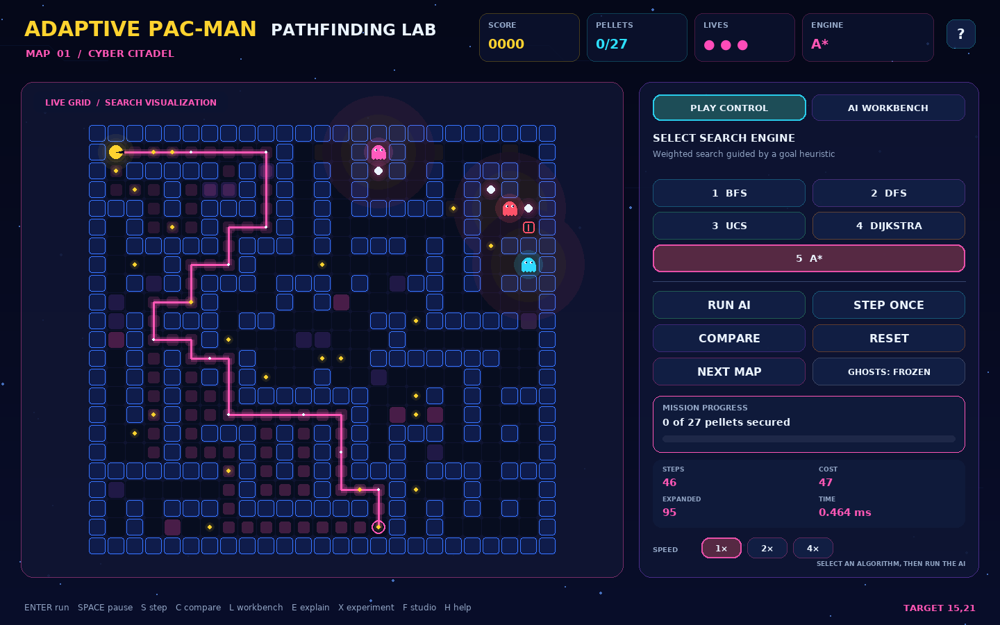

# Adaptive Pac-Man AI Pathfinding Laboratory

An established Python/Pygame AI game where Pac-Man automatically collects
pellets, avoids intelligent ghosts, and reaches an exit using **BFS, DFS, UCS,
Dijkstra, or A\***. The upgraded edition preserves the original five search
implementations and gameplay while adding an explainable AI workbench, custom
map editor, experiments, replays, and CSV/PDF evidence export.



## What is included

### Original project features preserved

- Five independent search implementations: BFS, DFS, UCS, Dijkstra, and A*
- Three deterministic, replayable neon mazes
- Weighted terrain and distance-based ghost-danger costs
- Pellets, power pellets, score, lives, moving ghosts, and a locked exit
- Automatic target selection and route replanning
- Live explored-cell and selected-route visualization
- Algorithm comparison from one fair, unchanged snapshot
- Run, pause, single-step, reset, map, speed, and ghost controls
- Procedural graphics and sound with no downloaded game assets

### Upgraded features

- **Explainable AUTO selector:** chooses one of the original five algorithms
  using visible deterministic rules; AUTO is a controller, not a sixth search.
- **A* heuristic laboratory:** Manhattan, Euclidean, and Weighted A* modes with
  a fair side-by-side comparison.
- **Advanced ghost team:** Aggressive, Predictive, Random, and Defensive
  policies. Classic BFS chasing remains available as a compatibility mode.
- **Risk heatmap:** displays the same danger penalties used by weighted search.
- **Map Studio:** edits walls, floor, start, exit, pellets, power pellets,
  ghosts, and terrain costs. Saving creates a new validated JSON file and never
  overwrites a packaged map.
- **Reproducible Experiment Mode:** benchmarks all algorithms across five fixed
  targets with three timing samples per algorithm.
- **Explainable AI panel:** identifies the data structure, expansion rule,
  correctness guarantee, route rationale, and observed metrics.
- **Mission Replay:** records up to 2,500 bounded frames, provides playback, and
  saves a portable JSON timeline.
- **Evidence export:** produces raw CSV results, a presentation-ready PDF
  summary, and a JSON replay in `exports/`.
- **Two-tab control panel:** separates normal play controls from research tools
  so the game stays readable during a live demo.

## Requirements

- Python 3.10 or newer
- Windows, macOS, or Linux
- About 70 MB of free space after installing dependencies

No database, API key, account, or network service is required after setup.

## Ubuntu/Linux setup

Open a terminal inside the extracted project folder and run one command at a
time:

```bash
sudo apt update
sudo apt install -y python3 python3-venv python3-pip
python3 -m venv .venv
source .venv/bin/activate
python -m pip install --upgrade pip
python -m pip install -r requirements.txt
python main.py
```

For later runs:

```bash
cd /path/to/adaptive_pacman_ai
source .venv/bin/activate
./run_linux.sh
```

## Windows PowerShell setup

```powershell
py -m venv .venv
.venv\Scripts\Activate.ps1
python -m pip install --upgrade pip
python -m pip install -r requirements.txt
python main.py
```

If PowerShell blocks activation, allow it only in the current terminal:

```powershell
Set-ExecutionPolicy -Scope Process -ExecutionPolicy Bypass
.venv\Scripts\Activate.ps1
```

Use `run_windows.bat` after the first setup.

## Controls

| Action | Keyboard | Interface |
|---|---:|---|
| Select BFS, DFS, UCS, Dijkstra, A* | `1`–`5` | Play Control tab |
| Start or stop AI | `Enter` | Run AI / Stop AI |
| Pause or resume | `Space` | Keyboard |
| Advance one player cell | `S` | Step Once |
| Compare five algorithms | `C` | Compare |
| Reset mission | `R` | Reset |
| Next map | `M` | Next Map |
| Freeze/activate ghosts | `G` | Ghosts button |
| Switch control-panel tab | `L` | Play Control / AI Workbench |
| Toggle AUTO selector | `A` | AI Workbench |
| Explain current route | `E` | Explain Route |
| Run experiment | `X` | Experiment |
| Compare A* heuristics | `J` | Heuristics |
| Open replay | `V` | Replay |
| Open Map Studio | `F` | Map Studio |
| Export CSV/PDF/replay | `B` | Export CSV/PDF |
| Help | `H` | `?` |

Replay controls use `Left`, `Right`, and `Space`. Map Studio uses `1`–`9` for
brushes, `V` to validate, `S` to save and play, and `Esc` to return safely.

## Search and cost model

Every walkable grid cell is a graph node. Legal four-direction moves are edges.
The base terrain cost is 1, 2, or 3. When ghosts are active and not frightened,
the destination receives this additional soft danger penalty:

| Nearest ghost distance | Added cost |
|---:|---:|
| 0 cells | 40 |
| 1 cell | 12 |
| 2 cells | 5 |
| 3 cells | 2 |
| 4+ cells | 0 |

BFS and DFS ignore weights while choosing their path but still report the real
cost afterward. UCS, Dijkstra, and A* use terrain plus danger costs during
planning.

## A* heuristic modes

| Mode | Formula/idea | Optimality in this grid |
|---|---|---|
| Manhattan | `|x₁-x₂| + |y₁-y₂|` | Guaranteed |
| Euclidean | Straight-line distance | Guaranteed, usually less informed |
| Weighted A* | `g(n) + 1.65 × Manhattan` | Not guaranteed; often fewer expansions |

The default remains Manhattan A*, preserving the original behavior and
weighted optimality tests.

## Fair experiment rule

The workbench selects deterministic near-to-far targets from the current map.
For each target, every algorithm receives the same:

- start and goal;
- walls and terrain costs;
- ghost positions and danger penalties;
- frightened/power state.

The report records success, steps, weighted cost, expanded nodes, frontier peak,
and planning time. Time depends on hardware, so path cost, steps, and expansion
counts are the stronger reproducible measures.

## Project structure

```text
adaptive_pacman_ai/
├── main.py
├── pacman_ai/
│   ├── algorithms.py       BFS, DFS, UCS, Dijkstra, A*, heuristic variants
│   ├── planner.py          Costs, target choice, AUTO rules, comparisons
│   ├── session.py          Gameplay, ghost policies, experiments, exports
│   ├── maze.py             Generated/explicit map loading and validation
│   ├── editor.py           Safe Map Studio model
│   ├── experiments.py      Benchmarks and CSV/PDF reports
│   ├── replay.py           Bounded replay recording and JSON export
│   ├── explain.py          Human-readable algorithm explanations
│   ├── ui.py               Neon interface, workbench, editor, and modals
│   ├── app.py              Input, scene, update, rendering controller
│   ├── audio.py            Optional procedural sounds
│   ├── models.py           Shared enums and data classes
│   └── settings.py         Visual and gameplay constants
├── maps/                   Three packaged maps; custom maps save under custom/
├── tests/                  Original regression tests plus upgrade tests
├── docs/                   Report, architecture, algorithms, demo, viva notes
├── screenshots/            Verified upgraded interface gallery
├── presentation/           Neutral editable project presentation
├── sample_outputs/         Verified sample CSV/PDF/replay evidence
├── exports/                Runtime exports created by the game
├── requirements.txt
├── run_tests.py
├── run_linux.sh
└── run_windows.bat
```

## Verification

Run the complete standard-library suite:

```bash
python run_tests.py
```

Optional pytest output:

```bash
python -m pip install -r requirements-dev.txt
pytest
```

Headless rendering check:

```bash
python main.py --smoke-test
```

Render the complete visual QA gallery:

```bash
python main.py --qa-gallery qa_gallery
```

Verified deliverables are included in:

- `presentation/Adaptive_Pacman_AI_Upgraded_Presentation_Final.pptx`
- `sample_outputs/algorithm_experiment_sample.csv`
- `sample_outputs/algorithm_experiment_sample.pdf`
- `sample_outputs/mission_replay_sample.json`
- `screenshots/upgraded_interface_gallery.png`

The final verification result is **19/19 automated tests passed**, plus a
successful headless startup/render check. See `docs/VERIFICATION_RESULTS.md`
for the reproducible experiment tables and artifact checks.

## Important viva points

- UCS and Dijkstra normally match in this single-source, single-target,
  non-negative weighted grid, but they remain independent implementations.
- AUTO does not invent a new algorithm; it chooses among the required five and
  gives a rule-based reason.
- Weighted A* can be faster but sacrifices the optimality guarantee.
- The risk heatmap visualizes the same cost function used by weighted search.
- Map Studio saves explicit maps separately, validates connectivity, and keeps
  the packaged maps unchanged.
- Experiment claims apply to controlled packaged-map scenarios, not every
  possible map or computer.

## Known limitations

- Small-map timings are often below one millisecond and vary by hardware.
- The project uses transparent classical search, not reinforcement learning.
- Replay stores logical frames rather than video, keeping files small and
  inspectable.
- Custom maps are local JSON files; there is no cloud sharing or database.
