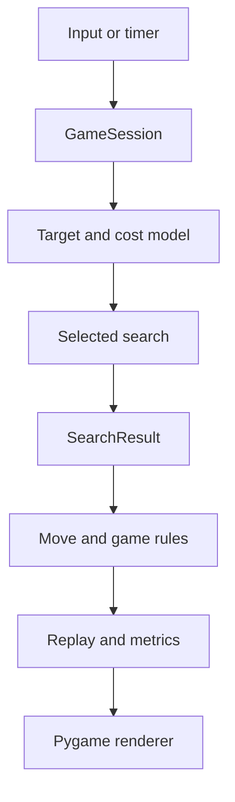
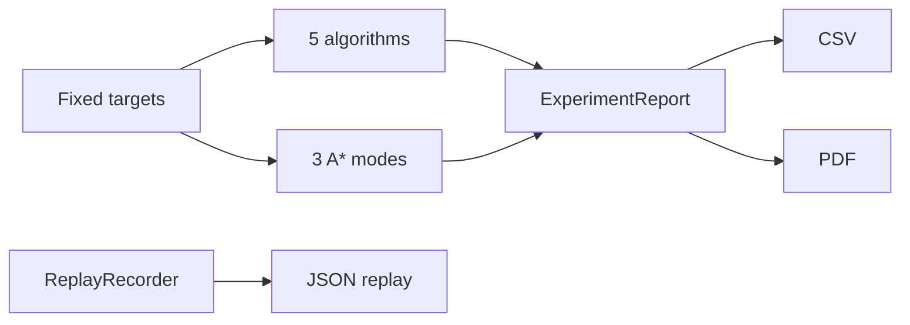

# Architecture and Data Flow

## Design goals

The upgraded architecture preserves the original five algorithms and game rules
while keeping editing, experiments, explanations, replay, reporting, and Pygame
rendering isolated. Search and gameplay logic can still run in a headless test.

## Components

| Module | Responsibility |
|---|---|
| `main.py` | Normal launch, screenshot, smoke test, and QA-gallery options |
| `pacman_ai/app.py` | Event loop, scenes, timers, actions, replay playback |
| `pacman_ai/ui.py` | Menu, game, workbench, modals, charts, and Map Studio |
| `pacman_ai/session.py` | Game state, ghost policies, AUTO, replay, experiments |
| `pacman_ai/planner.py` | Cost model, target choice, AUTO rules, comparisons |
| `pacman_ai/algorithms.py` | Five searches and three A* heuristic modes |
| `pacman_ai/maze.py` | Generated/explicit JSON loading and validation |
| `pacman_ai/editor.py` | Safe editable copy and new-file map saving |
| `pacman_ai/experiments.py` | Controlled benchmarks and CSV/PDF export |
| `pacman_ai/replay.py` | Bounded logical frames and JSON serialization |
| `pacman_ai/explain.py` | Human-readable decision and metric explanations |
| `pacman_ai/models.py` | Shared enums and data classes |
| `pacman_ai/audio.py` | Optional in-memory sound effects |

## Runtime flow



The search layer never imports Pygame. Tests can construct a `SearchProblem`
with a tiny in-memory graph and verify algorithm behavior directly.

## Search contract

Every algorithm receives:

```python
SearchProblem(
    start=(x1, y1),
    goal=(x2, y2),
    neighbors=maze.neighbors,
    step_cost=cost_function,
)
```

Every algorithm returns a `SearchResult` containing:

- `found`;
- reconstructed `path`;
- deterministic `explored_order`;
- weighted `path_cost`;
- measured `elapsed_ms`;
- `frontier_peak`;
- A* heuristic metadata when applicable.

## Compatibility boundary

The original behavior remains selectable:

- manual BFS, DFS, UCS, Dijkstra, and Manhattan A*;
- classic BFS ghost chase;
- packaged generated maps;
- original play controls and same-snapshot comparison.

Upgrades wrap or extend these interfaces:

- AUTO chooses an existing `Algorithm`; it is not a sixth algorithm.
- Heuristic mode is an optional keyword with Manhattan as the default.
- advanced ghosts are a session preference that can be disabled.
- Map Studio edits a deep logical copy and writes an explicit map separately.
- replay and experiments observe session/search outputs rather than changing
  algorithm code.

## Map formats

### Generated map

The original JSON format stores a seed, dimensions, entity counts, loop chance,
and accent color. `Maze.generate` recreates the same connected maze.

### Explicit custom map

Map Studio writes `format: explicit-v1` with exact walls, start, exit, pellets,
ghost starts, and weighted terrain. Loading applies the same validation used for
packaged maps.

Saving never overwrites a packaged map. New files are created under
`maps/custom/`.

## Experiment and export flow



Each algorithm receives an unchanged scenario snapshot. CSV contains raw rows;
PDF contains summaries; replay contains logical frames.

## Failure handling

- Missing/invalid maps raise explicit errors.
- Unreachable entities and open borders are rejected.
- Search returns `found=False` and an empty path when no route exists.
- A live route blocked by a ghost is discarded and replanned.
- Replay is bounded to avoid unlimited memory growth.
- Map Studio validates before writing and refuses filename overwrites.
- PDF dependencies are imported lazily and give a clear installation error.
- Audio failure disables sound without stopping the game.
- Packaged maps remain available even if a custom-map edit is invalid.

## Maintainability

- Dataclasses and enums make cross-module values explicit.
- Deterministic neighbor order and map seeds keep demonstrations reproducible.
- Runtime export code uses standard CSV/JSON plus ReportLab for PDF.
- Original regression tests run together with upgrade tests.
- UI tabs prevent advanced tools from crowding ordinary gameplay.

